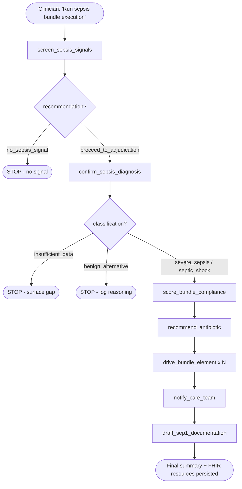
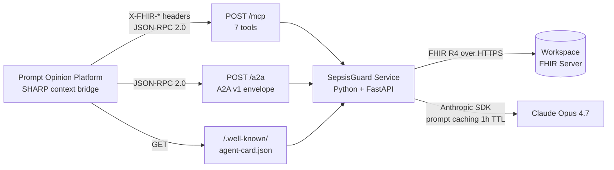

<div align="center">

# SepsisGuard

### The SEP-1 Bundle Co-Pilot for the ICU

**Watches the ICU. Drives the bundle. Documents the case.**

A multi-agent, FHIR-native system that detects emerging sepsis from structured *and* free-text signals, executes the CMS SEP-1 bundle in real time, drafts antibiotic regimens for clinician sign-off, and produces CMS-abstractor-grade documentation.

[](LICENSE)
[](pyproject.toml)
[](https://hl7.org/fhir/R4/)
[](https://spec.modelcontextprotocol.io/)
[](https://promptopinion.ai)
[](tests/test_tools.py)

</div>

---

## 🚀 Live deployment

| Resource | Link |
|---|---|
| **MCP endpoint** | [`https://sepsisguard-production.up.railway.app/mcp`](https://sepsisguard-production.up.railway.app/mcp) |
| **Health check** | [`/health`](https://sepsisguard-production.up.railway.app/health) |
| **Agent card** | [`/.well-known/agent-card.json`](https://sepsisguard-production.up.railway.app/.well-known/agent-card.json) |
| **Marketplace** | Published as `SepsisGuard MCP` + `SepsisGuard ICU Co-Pilot` on [Prompt Opinion](https://app.promptopinion.ai) |
| **Demo video** | *(YouTube link — added at submission)* |
| **Hackathon** | [Agents Assemble — The Healthcare AI Endgame](https://devpost.com/) (May 2026) |

---

## Table of contents

1. [The problem](#the-problem)
2. [Why generative AI is required](#why-generative-ai-is-required)
3. [The solution](#the-solution)
4. [How it works](#how-it-works)
5. [Quick start](#quick-start)
6. [Demo scenarios](#demo-scenarios)
7. [Architecture](#architecture)
8. [Standards implemented](#standards-implemented)
9. [Safety & compliance](#safety--compliance)
10. [Tests](#tests)
11. [Documentation](#documentation)
12. [Repository layout](#repository-layout)
13. [License](#license)

---

## The problem

Sepsis is the **#1 most expensive condition in US hospitals**. The deployed industry leader misses two-thirds of cases.

| Metric | Value | Source |
|---|---|---|
| US sepsis deaths / year | **350,000** | CDC |
| US adult sepsis hospitalizations / year | 1.7 million | CDC |
| US hospital cost (2022) | **$60.0 billion** | AHRQ HCUP |
| Rank among US inpatient conditions | **#1 — most expensive** | AHRQ HCUP 2022 |
| Mortality increase per hour of antibiotic delay | **4–7%** | Surviving Sepsis Campaign 2021 |
| Epic Sepsis Model recall (external validation) | **0.33 — missed 67% of cases** | Wong et al., *JAMA Internal Med* 2021 |
| Epic Sepsis Model alert burden | 18% of all admitted patients | Wong et al., 2021 |
| SEP-1 under Hospital Value-Based Purchasing | **FY2026 — active** | CMS Hospital IQR / VBP |

CMS made SEP-1 a pay-for-performance measure under Hospital Value-Based Purchasing for FY2026. Sepsis is no longer just a clinical problem — it is revenue-cycle infrastructure. For a 300-bed acute-care hospital, the projected recovery from improved SEP-1 compliance is approximately **$2–3M per year**.

---

## Why generative AI is required

A rule engine cannot solve this. Five reasons:

1. **Free-text signals are the earliest signals.** The first sepsis indicators appear in nursing notes ("patient looks unwell, mottled skin"), microbiology stubs ("gram-negative rods on initial Gram stain"), and radiology conclusions ("findings consistent with pneumonia"). The Epic Sepsis Model fails because it cannot read them. An LLM does.

2. **Trajectory reasoning, not threshold matching.** "Is this patient *getting worse*?" requires comparing serial labs and vitals over hours and weighting the trend against baseline — judgment, not a rule.

3. **Bundle adjudication has dozens of failure modes.** "Hypotension wasn't persistent — only one reading"; "lactate drawn at 4h but bundle clock started at 0h"; "fluid given was colloid, not crystalloid — doesn't count toward 30 mL/kg." Each requires reading multiple FHIR resources together with timestamps and clinical context.

4. **CMS abstractors read prose, not data fields.** The abstractor scores SEP-1 by reading the chart note. It must explicitly say: "Bundle initiated at 14:32 in response to lactate 4.1 and SBP 86 mmHg consistent with septic shock; antibiotics ordered as cefepime + vancomycin..." — exactly what LLMs do.

5. **Step-down judgment.** When does the agent stop driving? Patient improved? Transferred? De-escalated? Not a flowchart — context-sensitive decisions about bundle continuation.

---

## The solution

Five clinical agents. Seven MCP tools. One Python service.

| Agent | Tool(s) it owns | Clinical role |
|---|---|---|
| **Sentinel** | `screen_sepsis_signals` | Reads FHIR. Computes SIRS / qSOFA / organ-dysfunction markers. Scans nursing notes for free-text triggers. |
| **Adjudicator** | `confirm_sepsis_diagnosis` | LLM reasoning over the screening packet. Confirms severe sepsis / septic shock. Establishes Time Zero. Rules out benign alternatives. |
| **Bundle Orchestrator** | `score_bundle_compliance`<br>`drive_bundle_element`<br>`notify_care_team` | Walks the FHIR record from Time Zero. Classifies every 3-hr / 6-hr element. Creates FHIR Tasks and Communications. |
| **Pharmacist** | `recommend_antibiotic` | Reads patient AllergyIntolerance + eGFR + weight. Drafts regimen with guideline citations. **Clinician sign-off required, always.** |
| **Documentation** | `draft_sep1_documentation` | Drafts the CMS-abstractor-grade SEP-1 progress note with FHIR resource references for every clinical claim. |

**Three deployable artifacts in one Python service:**

1. **MCP server** exposing 7 tools at `POST /mcp` (JSON-RPC 2.0, Streamable HTTP transport).
2. **A2A v1 agent card** at `GET /.well-known/agent-card.json` declaring 3 skills + the `ai.promptopinion/fhir-context` extension.
3. **BYO Agent on Prompt Opinion** ("SepsisGuard ICU Co-Pilot") published on the Marketplace.

---

## How it works

### The default trajectory



### Hard safety rules (enforced by the orchestrator system prompt)

- **Never fabricate** vitals, labs, or timestamps — every claim must trace to a tool result.
- **Never auto-administer** medications — antibiotic regimens are always drafts marked `needs_clinician_signoff: true` (server-side enforced).
- **No PHI in conversational output** — refer to "the patient" only, even when names are available.
- **Halt on `insufficient_data`** — surface the named gap and stop. Never speculate.
- **Urgent notifications on missed deadlines** — `notify_care_team` escalates to `urgent` or `stat` if any element is non-compliant; continue driving remaining elements.

---

## Quick start

### Run offline demo (no API key required)

The deterministic offline mode uses an in-process FHIR mock so the demo runs anywhere, even without an Anthropic API key.

```bash
git clone https://github.com/Kaustubh-404/sepsisguard
cd sepsisguard
python -m venv .venv && source .venv/bin/activate
pip install -r requirements.txt

python -m sepsisguard.demo --scenario all
```

### Run with real Claude orchestrator

```bash
cp .env.example .env
# Edit .env, paste your ANTHROPIC_API_KEY

python -m sepsisguard.demo --scenario cap_severe_sepsis
```

### Start the MCP server

```bash
python -m sepsisguard.server --transport sse --port 8080

# Verify it's running
curl http://localhost:8080/health
# → {"status":"ok","name":"sepsisguard","version":"0.1.0"}
```

### Endpoints

| Method | Path | Purpose |
|---|---|---|
| `GET` | `/` | Server info |
| `GET` | `/health` | Health check (used by Railway) |
| `GET` | `/.well-known/agent-card.json` | A2A v1 agent card |
| `POST` | `/mcp` | MCP JSON-RPC (`initialize`, `tools/list`, `tools/call`, `agent/run`) |
| `POST` | `/a2a` | A2A v1 message endpoint |
| `GET` | `/mcp/sse` | Optional SSE keepalive |

---

## Demo scenarios

Three synthetic ICU patients (`data/examples/*.json`). Each exercises a different SepsisGuard capability:

| Scenario | Demonstrates |
|---|---|
| **CAP severe sepsis** | Canonical path — SIRS 4/4 + organ dysfunction + pneumonia + cefepime/vanc regimen |
| **Hospital UTI (Foley-associated)** | **Free-text adjudication wins** — borderline vitals, no infection-coded Condition. Agent infers CAUTI from nursing note + urinalysis. Substitutes cefepime for pip-tazo with cross-reactivity rationale for PCN allergy. |
| **Intra-abdominal septic shock** | **Shock pathway** — lactate 5.8 + MAP 55, classification flips to `septic_shock`, vasopressors scheduled, anaerobic coverage |

Generate uploadable FHIR transaction bundles (POST-only, `urn:uuid:` references):

```bash
python scripts/scenarios_to_fhir_bundles.py
# Output: data/fhir_bundles/{cap,uti,intra_abdominal}*.bundle.json
```

Full clinical detail in [`docs/DEMO_SCENARIOS.md`](docs/DEMO_SCENARIOS.md).

---

## Architecture



### Key design choices

- **One in-process SHARP context per request** — bound from `X-FHIR-Server-URL` / `X-FHIR-Access-Token` / `X-Patient-ID` headers. Flows through every tool via `contextvars.ContextVar` (no threading arguments).
- **Scope-enforced FHIR access** — 15 SMART scopes declared in the agent card; `require_scope()` checked before every FHIR I/O.
- **Prompt caching with 1-hour TTL** on system prompts and the cached CMS abstractor rubric. Observed cache hit ratio in production: **0.70–0.77**.
- **Cache breakpoint hygiene** — agent loop strips `cache_control` from older `tool_result` blocks each iteration (Anthropic enforces max 4 breakpoints per request).

### Typical run telemetry

| Metric | Value |
|---|---|
| Tool calls per run | 11 |
| Wall-clock time | ~90 seconds |
| Total input tokens | ~14,000 |
| Output tokens | ~4,000 |
| Cache read tokens | ~38,000 |
| Cache hit ratio | **0.70–0.77** |
| Cost per execution | **~$0.10–0.20** |

---

## Standards implemented

| Standard | Role |
|---|---|
| **MCP** 2024-11-05 | JSON-RPC 2.0 at `POST /mcp` with `initialize`, `tools/list`, `tools/call`, `agent/run` |
| **A2A v1.0** | Agent card declaring 3 skills + `fhir-context` extension; message envelope at `POST /a2a` |
| **SHARP-on-MCP** | `X-FHIR-*` header transport for FHIR session credentials |
| **FHIR R4** | Reads Patient, Encounter, Observation, Condition, MedicationRequest/Administration, AllergyIntolerance, DiagnosticReport, DocumentReference, Specimen, Procedure. Writes Task, Communication, DocumentReference. |
| **US Core 6.1** | Resource profile alignment |
| **SMART App Launch v2** | 15 scopes (9 reads + 4 writes + 2 optional) |
| **CMS SEP-1** (Hospital VBP FY2026) | Encoded in `sep1_definition.py` — criteria, deadlines, scoring math |
| **Surviving Sepsis Campaign 2021** | Cited in antibiotic recommendations and orchestrator prompt |
| **IDSA Guidelines** (HAP/UTI/Intra-Abdominal) | Cited in `recommend_antibiotic` |
| **HIPAA §164.312** | Access control · audit · integrity · authentication · transmission |

---

## Safety & compliance

Hard-coded into the orchestrator prompt and enforced server-side:

- **No fabricated values** — every clinical claim traces to a tool result; agent halts on `insufficient_data`.
- **No auto-administration** — every antibiotic recommendation returns `needs_clinician_signoff: true`. The platform surfaces this prominently in the UI.
- **No PHI in conversational output** — refer to "the patient"; never name, MRN, DOB, or address (even when populated for UI rendering).
- **HIPAA-grade audit log** — JSONL append-only at `logs/audit.jsonl`. Records FHIR references (`Patient/abc-123`), event names, durations — **never PHI content**. Free-text values >200 chars are truncated. See [`docs/HIPAA_COMPLIANCE.md`](docs/HIPAA_COMPLIANCE.md) for the full §164.312 mapping.
- **Scope-enforced FHIR access** — 15 SMART scopes; `require_scope()` validated before every read or write.

---

## Tests

```bash
PYTHONPATH=src pytest tests/ -v
```

**20 tests · ~60 seconds · no API key required.** Coverage:

- Infrastructure (SHARP context scope checks, audit log)
- Domain (SEP-1 truth tables, bundle scoring math, antibiogram + PCN allergy substitution)
- Tools (deterministic FHIR walks + Claude stub fallbacks)
- Server (FastAPI health, agent card, MCP initialize, tools/list)
- End-to-end demo scenario

---

## Documentation

| Document | What it covers |
|---|---|
| [`SEPSISGUARD_BUILD_SPEC.md`](SEPSISGUARD_BUILD_SPEC.md) | Full 1,536-line build specification (source of truth) |
| [`docs/ARCHITECTURE.md`](docs/ARCHITECTURE.md) | System diagram, 5 agents, 2 cross-cutting concerns |
| [`docs/DEMO_SCENARIOS.md`](docs/DEMO_SCENARIOS.md) | Three scenarios with expected outcomes |
| [`docs/IMPACT_METRICS.md`](docs/IMPACT_METRICS.md) | All stats with citations + per-hospital ROI math |
| [`docs/HIPAA_COMPLIANCE.md`](docs/HIPAA_COMPLIANCE.md) | §164.312 access / audit / integrity / auth / transmission mapping |
| [`docs/SEP1_BUNDLE.md`](docs/SEP1_BUNDLE.md) | CMS abstraction rules + common failure modes + scoring template |
| [`docs/DEPLOY_TO_PROMPT_OPINION.md`](docs/DEPLOY_TO_PROMPT_OPINION.md) | 7-step deploy checklist (Railway + Marketplace) |
| [`PHASES.md`](PHASES.md) | 8-phase development plan |
| [`CLAUDE.md`](CLAUDE.md) | Agent guidance for Claude Code instances |

---

## Repository layout

```
sepsisguard/
├── src/sepsisguard/
│   ├── server.py             FastAPI MCP + A2A endpoints
│   ├── agent_loop.py         Claude tool-use orchestrator
│   ├── sharp_context.py      Per-request SHARP context (ContextVar)
│   ├── fhir_client.py        Async FHIR R4 client + scope enforcement
│   ├── claude_client.py      Anthropic SDK wrapper with prompt caching
│   ├── audit.py              JSONL audit log (references only, no PHI)
│   ├── sep1_definition.py    SEP-1 criteria + bundle scoring math
│   ├── antibiogram.py        Antibiotic selection + allergy logic
│   ├── shadow_abstractor.py  CMS-abstractor scoring simulator
│   ├── demo.py               In-process FHIR mock + scenario runner
│   ├── tools/                The 7 MCP tools
│   ├── loinc.py · rxnorm.py · alert_store.py
├── agent/
│   ├── agent_card.json       A2A v1 agent card
│   └── agent_prompt.md       Orchestrator system prompt
├── data/
│   ├── examples/             3 scenario JSONs
│   ├── clinical_notes/       3 nursing/admit notes (base64-loaded into FHIR)
│   ├── fhir_bundles/         3 uploadable FHIR transaction bundles
│   ├── antibiogram/          Local antibiogram (organism × drug × susceptibility)
│   └── sep1_abstractor_rubric.md
├── docs/                     6 deep-dive docs
├── demo/                     Demo UI + video script + recording notes
├── scripts/                  Bundle generator
├── tests/                    Pytest suite (20 tests, no API key required)
└── ...                       LICENSE · README · requirements · Procfile · railway.toml
```

---

## License

[Apache 2.0](LICENSE) — open source, commercial use permitted.

---

<div align="center">

**SepsisGuard — Watch the ICU. Drive the bundle. Document the case.**

Built for [Agents Assemble: The Healthcare AI Endgame](https://devpost.com/) · May 2026

</div>
